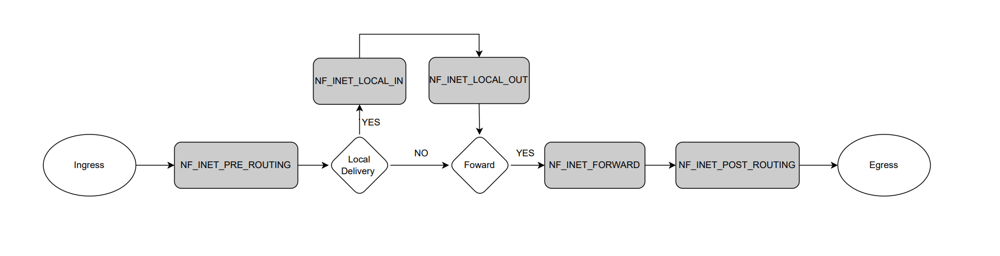

# mktables

This is basically just a really hard to find firewall.

mktables is a kernel module that uses netfilter to hook the Linux network stack. In this scenario, the NF_IP_PRE_ROUTING hook is used to run a handle function before any routing decisions are made with a packet, incoming or outgoing. With the current configuration (PORT=0x50 or PORT=80 if you convert to decimal), any incoming packets with a destination port of 80 will be dropped.

This throws off the usual Blue Team debugging steps of "if it is reachable locally but not remotely, it must be a firewall, iptables or nftables". The NF_IP_PRE_ROUTING hook is executed prior to any routing decisions, so that includes local connections.

While this may be too difficult for most Blue Teamers to find, I plan on dropping this on only one host mid-way through the competition, then giving them hints for where to look (i.e. syslog, loaded modules)

## Usage

To compile the module, you will need to 